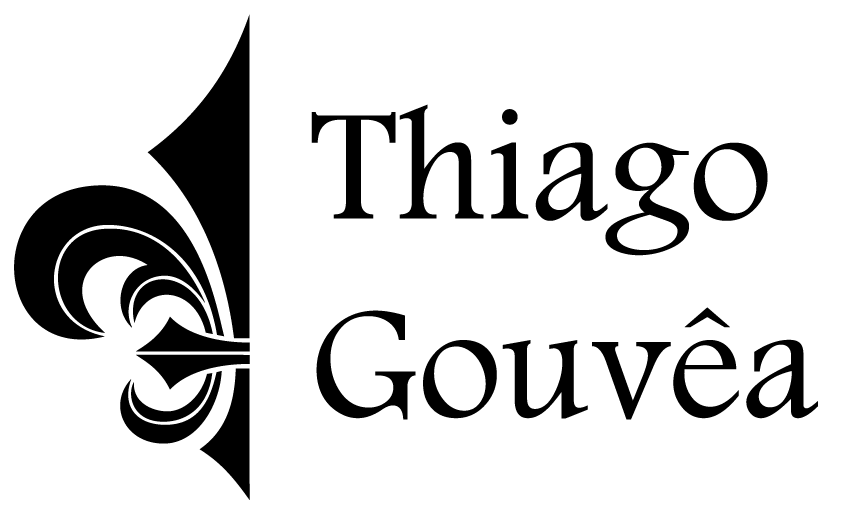

  

  
  

## 💻 Projeto

gostack-level-1-reactjs-concepts

## 📝 Licença

Esse projeto está sob a licença MIT. Veja o arquivo [LICENSE](LICENSE) para mais detalhes.

---

  GoStack 2020 - Nível 01 - Desafio: Conceitos do Node.js

